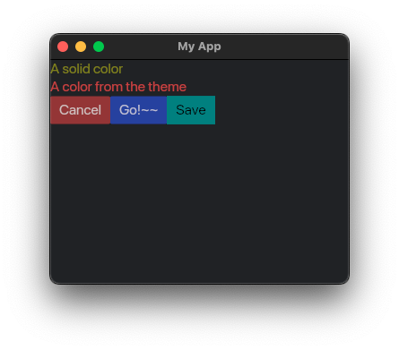

# Changing Styles

Changing styles changed substantially in iced 0.13.x. Like previous versions, most widgets support the `style` method to change their styles.

However, the [`style`](https://docs.rs/iced/0.13.1/iced/widget/struct.Button.html#method.style) method now takes a closure that receives the theme and the widget's state as arguments, if applicable. This allows for more dynamic and flexible styling. You can use the widget's [Style](https://docs.rs/iced/0.13.1/iced/widget/button/struct.Style.html) struct directly in the closure to define styling attributes like color, background, and more.

Also, the widgets expose predefined functions like [`danger`](https://docs.rs/iced/0.13.1/iced/widget/button/fn.danger.html), [`primary`](https://docs.rs/iced/0.13.1/iced/widget/button/fn.primary.html), etc. This is particular for each widget.

For example, the [Text](https://docs.rs/iced/0.13.1/iced/widget/type.Text.html) widget accepts a [`text::Style`](https://docs.rs/iced/0.13.1/iced/widget/text/struct.Style.html) struct on its [`style`](https://docs.rs/iced/0.13.1/iced/advanced/widget/struct.Text.html#tymethod.style) method. But you can also use the predefined styles like [`danger`](https://docs.rs/iced/0.13.1/iced/widget/text/fn.danger.html) or [`primary`](https://docs.rs/iced/0.13.1/iced/widget/text/fn.primary.html).
Similarly, the [Button](https://docs.rs/iced/0.13.1/iced/widget/struct.Button.html) widget accepts a [`button::Style`](https://docs.rs/iced/0.13.1/iced/widget/button/struct.Style.html) struct on its [`style`](https://docs.rs/iced/0.13.1/iced/widget/button/struct.Button.html#method.style) method. But you can also use the predefined styles like [`danger`](https://docs.rs/iced/0.13.1/iced/widget/button/fn.danger.html) or [`primary`](https://docs.rs/iced/0.13.1/iced/widget/button/fn.primary.html). Note that the button widget gets a `status` argument on its `style` method that can be used to change the style based on the button's state.

```rust
use iced::{
    Background, Color, theme,
    widget::{button, column, row, text},
};

fn main() -> iced::Result {
    iced::run("My App", MyApp::update, MyApp::view)
}

#[derive(Debug, Clone)]
enum Message {}

#[derive(Default)]
struct MyApp;

impl MyApp {
    fn update(&mut self, _message: Message) {}

    fn view(&self) -> iced::Element<Message> {
        column![
            text("A solid color").style(|_| text::Style {
                color: Some(Color::from_rgb(0.5, 0.5, 0.0))
            }),
            text("A color from the theme").style(text::danger),
            row![
                button("Cancel").style(button::danger),
                button("Go!~~").style(button::primary),
                button("Save").style(|_, _| button::Style {
                    background: Some(Background::Color(Color::from_rgb(0.0, 0.5, 0.5))),
                    ..Default::default()
                })
            ],
        ]
        .into()
    }
}
```



:arrow_right: Next: [Multipage Apps](./multipage_apps.md)

:blue_book: Back: [Table of contents](./../README.md)
