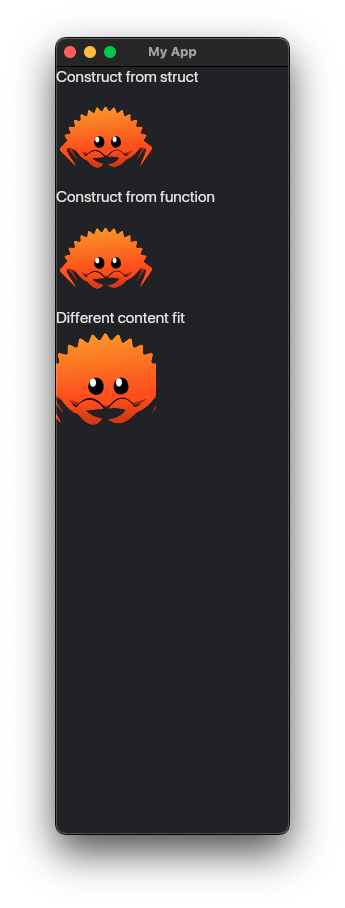

# Svg

The [Svg](https://docs.rs/iced/0.13.1/iced/widget/svg/struct.Svg.html) widget is able to display an [SVG](https://en.wikipedia.org/wiki/SVG) drawings.
It has two methods of constructions: the `svg` function and the `Svg::new` constructor.
We can set how to fit the image content into the widget bounds.

To use the widget, we have to enable the [svg](https://docs.rs/crate/iced/0.12.1/features#svg) feature.
The `Cargo.toml` dependencies should look like this:

```toml
[dependencies]
iced = { version = "0.12.1", features = ["svg"] }
```

Similar to the [Image](./image.md) widget, the `svg` widget expects a path to the SVG file.
The path is resolved relative to the current working directory. Since we run the application with cargo, the root directory is the project root. In our example below, the SVG file `ferris.svg` is in the `tutorial/pic` directory.

```rust
use iced::{
    ContentFit,
    widget::{Svg, column, svg, svg::Handle, text},
};

fn main() -> iced::Result {
    iced::run("My App", MyApp::update, MyApp::view)
}

#[derive(Debug, Clone)]
enum Message {}

#[derive(Default)]
struct MyApp;

impl MyApp {
    fn update(&mut self, _message: Message) {}

    fn view(&self) -> iced::Element<Message> {
        column![
            text("Construct from struct"),
            Svg::from_path("tutorial/pic/ferris.svg")
                .width(100)
                .height(100),
            text("Construct from function"),
            svg(Handle::from_path("tutorial/pic/ferris.svg"))
                .width(100)
                .height(100),
            text("Different content fit"),
            Svg::from_path("tutorial/pic/ferris.svg")
                .content_fit(ContentFit::Cover)
                .width(100)
                .height(100),
        ]
        .into()
    }
}
```



:arrow_right: Next: [Layouts](./layouts.md)

:blue_book: Back: [Table of contents](./../README.md)
